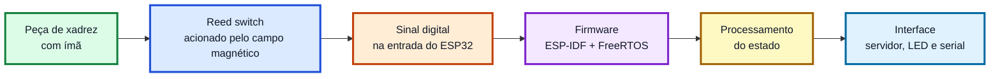
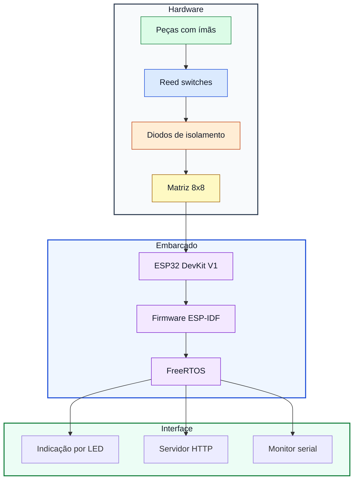
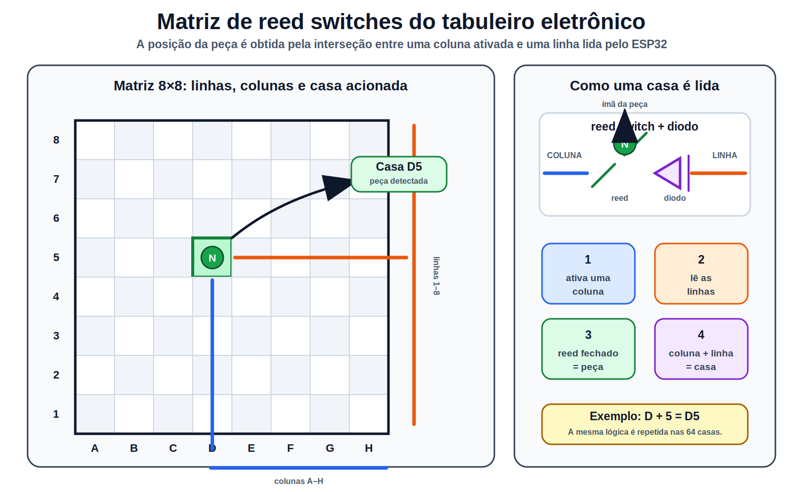
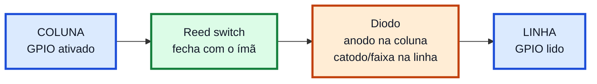
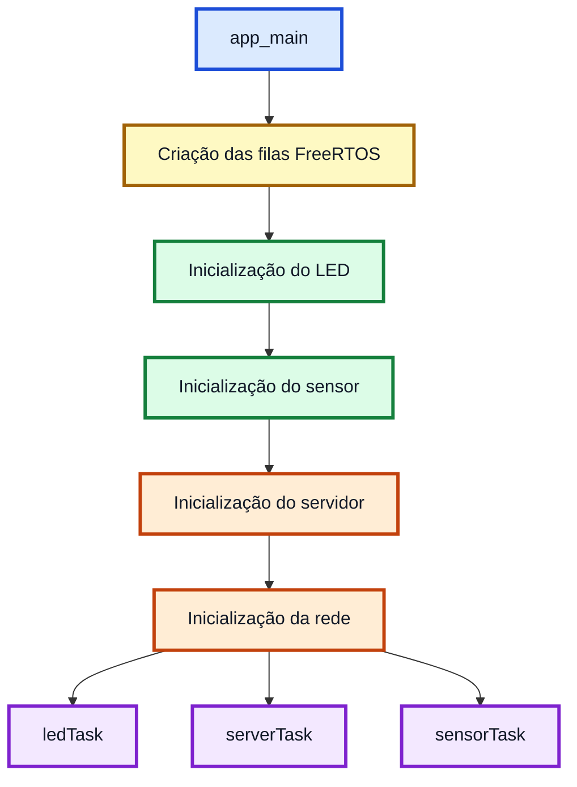

# Xadrez Eletrônico

<p align="center">
  
  
  
  
  
</p>

Projeto desenvolvido para a disciplina **OI25CP-7CPE**.

O **Xadrez Eletrônico** é um protótipo de tabuleiro inteligente baseado em **ESP32 DevKit V1**, sensores magnéticos do tipo **reed switch**, diodos de isolamento e peças com **ímãs de neodímio**. O sistema tem como finalidade detectar a presença de peças no tabuleiro e processar esse estado em firmware embarcado.

---

## Objetivo do trabalho

Desenvolver um protótipo funcional que demonstre a integração entre eletrônica digital, sensores magnéticos e programação embarcada para representar o estado físico de um tabuleiro de xadrez.

O trabalho explora:

- leitura digital de sensores magnéticos;
- uso de reed switches acionados por ímãs;
- organização elétrica em matriz 8x8;
- firmware em C com ESP-IDF;
- tarefas com FreeRTOS;
- interface embarcada para visualização do estado do sistema.

---

## Visão geral do sistema



Cada peça recebe um ímã de neodímio em sua base. Ao posicionar a peça sobre uma casa, o campo magnético fecha o reed switch correspondente. Esse fechamento altera o nível lógico lido pelo ESP32, permitindo que o firmware identifique a presença da peça.

O firmware atual está organizado em módulos e utiliza um sensor de validação conectado ao **GPIO13**. Essa implementação valida o princípio de leitura magnética e a comunicação entre sensor, processamento, servidor e LED.

---

## Arquitetura do protótipo



A arquitetura é composta por quatro blocos principais:

| Bloco | Função |
|---|---|
| Peças com ímãs | Acionam magneticamente os sensores do tabuleiro |
| Reed switches | Detectam a presença das peças nas casas |
| Matriz com diodos | Organiza eletricamente as casas e reduz caminhos indesejados de corrente |
| ESP32 DevKit V1 | Executa leitura, processamento, comunicação e indicação visual |

---

## Matriz de reed switches

<p align="center">
  
</p>

A matriz é formada por **8 colunas** e **8 linhas**, totalizando **64 casas**. Cada casa possui um reed switch em série com um diodo. Quando uma peça com ímã é posicionada sobre uma casa, o reed switch fecha e cria um caminho elétrico entre a coluna e a linha correspondentes.

No exemplo destacado na figura, a ativação da **coluna D** e a leitura da **linha 5** indicam a casa **D5**. O mesmo princípio é aplicado às demais casas do tabuleiro.

---

## Circuito de uma casa



Ligação conceitual:

```text
COLUNA ---- reed switch ---- anodo do diodo |>| catodo/faixa ---- LINHA
```

A função de cada elemento é:

| Elemento | Função no circuito |
|---|---|
| Reed switch | Fecha contato quando a peça com ímã está sobre a casa |
| Diodo | Reduz caminhos indesejados de corrente entre linhas e colunas |
| Linha/coluna | Permitem organizar eletricamente as casas do tabuleiro |
| ESP32 | Lê os sinais digitais e processa o estado detectado |

---

## Hardware utilizado

| Item | Componente | Quantidade | Função |
|---:|---|---:|---|
| 1 | ESP32 DevKit V1 | 1 | Controle embarcado do sistema |
| 2 | Reed switch | 64 | Sensoriamento magnético das casas |
| 3 | Diodo de sinal | 64 | Isolamento elétrico da matriz |
| 4 | Ímã de neodímio | 32 | Acionamento dos reed switches |
| 5 | Peças de xadrez | 32 | Peças adaptadas com ímãs |
| 6 | Resistores de 10 kΩ | 8 ou mais | Estabilização dos sinais digitais |
| 7 | Jumpers e fios | Conforme montagem | Conexão entre matriz e ESP32 |
| 8 | Base do tabuleiro | 1 | Estrutura física do protótipo |
| 9 | Cabo USB | 1 | Alimentação, gravação e monitor serial |

A lista em formato separado também está disponível em [`docs/BOM.md`](docs/BOM.md) e [`docs/BOM.csv`](docs/BOM.csv).

---

## Firmware embarcado

O firmware foi desenvolvido em **C** com **ESP-IDF** para o **ESP32 DevKit V1**.

| Arquivo | Responsabilidade |
|---|---|
| [`main/main.c`](main/main.c) | Inicialização geral, filas e tarefas FreeRTOS |
| [`main/sensor.c`](main/sensor.c) | Leitura do sensor magnético de validação |
| [`main/sensor.h`](main/sensor.h) | Interface pública do módulo de sensor |
| [`main/server.c`](main/server.c) | Servidor embarcado e estado da aplicação |
| [`main/server.h`](main/server.h) | Interface pública do módulo de servidor |
| [`main/led.c`](main/led.c) | Controle de indicação visual por LED |
| [`main/led.h`](main/led.h) | Interface pública do módulo de LED |
| [`main/app_types.h`](main/app_types.h) | Tipos compartilhados entre os módulos |

Fluxo de inicialização:



---

## Organização do repositório

```text
.
├── CMakeLists.txt
├── README.md
├── LICENSE
├── dependencies.lock
├── partitions.csv
├── sdkconfig.defaults
├── main/
│   ├── main.c
│   ├── sensor.c
│   ├── sensor.h
│   ├── server.c
│   ├── server.h
│   ├── led.c
│   ├── led.h
│   └── app_types.h
├── docs/
│   ├── BOM.md
│   ├── BOM.csv
│   └── assets/
│       └── figures/
├── hardware/
│   ├── schematics/
│   └── stl/
└── scripts/
    ├── build.sh
    ├── flash_acm0.sh
    ├── monitor_acm0.sh
    └── clean.sh
```

Pastas principais:

| Caminho | Conteúdo |
|---|---|
| [`main/`](main/) | Código-fonte do firmware ESP-IDF |
| [`docs/`](docs/) | Documentação auxiliar e lista de materiais |
| [`docs/assets/figures/`](docs/assets/figures/) | Figuras e diagramas vetoriais do projeto |
| [`hardware/schematics/`](hardware/schematics/) | Esquemáticos do circuito |
| [`hardware/stl/`](hardware/stl/) | Arquivos mecânicos/STL |
| [`scripts/`](scripts/) | Scripts auxiliares de build, flash e monitor |

---

## Compilação

```bash
git clone https://github.com/Breno-Sanchez/xadrez-eletronico.git
cd xadrez-eletronico
source ~/esp/esp-idf/export.sh
idf.py set-target esp32
idf.py build
```

Também há um script auxiliar:

```bash
./scripts/build.sh
```

---

## Gravação no ESP32

Para gravar o firmware e abrir o monitor serial:

```bash
idf.py -p /dev/ttyACM0 flash monitor
```

Ou, usando os scripts:

```bash
./scripts/flash_acm0.sh
./scripts/monitor_acm0.sh
```

Para sair do monitor serial:

```text
Ctrl + ]
```

---

## Validação do protótipo

A validação do sistema é feita por etapas:

| Teste | Resultado esperado |
|---|---|
| Sensor sem peça | Estado de peça ausente |
| Sensor com peça posicionada | Detecção da presença da peça |
| Evento do sensor | Envio de evento para a fila FreeRTOS |
| Servidor embarcado | Atualização do estado exibido |
| LED de indicação | Resposta visual conforme o estado processado |

Para a matriz 8x8, a validação física é feita casa por casa, de `a1` até `h8`, conferindo se o reed switch fecha corretamente com a aproximação da peça magnetizada.

---

## Estado de implementação

| Módulo | Estado |
|---|---|
| Estrutura ESP-IDF | Implementada |
| Organização modular do firmware | Implementada |
| Sensor magnético de validação | Implementado |
| Servidor embarcado | Implementado parcialmente |
| Controle de LED | Implementado |
| Estrutura física da matriz 8x8 | Em validação |
| Leitura matricial completa 8x8 | Planejada para evolução do protótipo |
| Esquemático final | Em documentação |
| Arquivos STL | Reservado para componentes mecânicos |

---

## Resultado esperado

O protótipo demonstra a viabilidade de um tabuleiro eletrônico capaz de converter a presença física de peças em sinais digitais processados por um microcontrolador. A solução combina sensores magnéticos, organização matricial, firmware embarcado e uma interface de visualização, servindo como base para a leitura completa das 64 casas e validação automática de movimentos.

---

## Autores

- **Breno Gabriel Barão Sanchez**
- **Jhonattan Santana**

Disciplina: **OI25CP-7CPE**

---

## Licença

Este projeto está disponível sob a licença MIT. Consulte [`LICENSE`](LICENSE).
