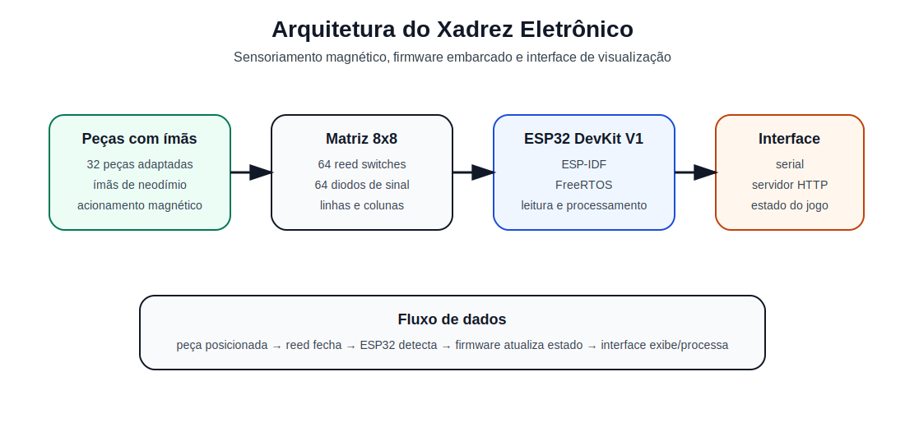
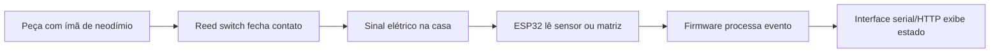
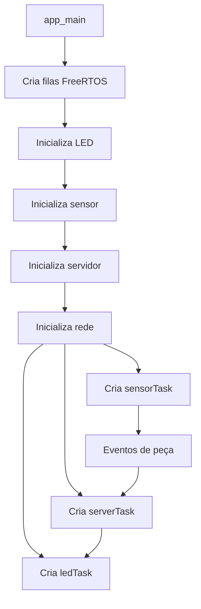
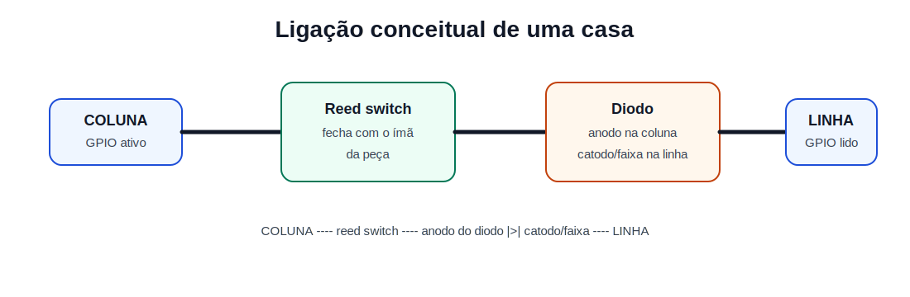
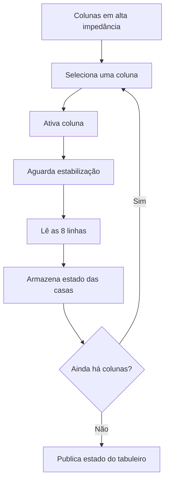

# Xadrez Eletrônico

<p align="center">
  
</p>

<p align="center">
  <a href="https://github.com/Breno-Sanchez/xadrez-eletronico"></a>
  
  
  
  
</p>

Projeto desenvolvido para a disciplina **OI25CP-7CPE**.

O **Xadrez Eletrônico** é um protótipo de tabuleiro inteligente baseado em **ESP32 DevKit V1**, sensores magnéticos do tipo **reed switch**, diodos de isolamento e peças com **ímãs de neodímio**. A proposta é detectar automaticamente a presença das peças nas casas do tabuleiro e disponibilizar o estado do jogo por firmware embarcado.

> Estado atual do firmware: o código embarcado já possui arquitetura modular com sensor, LED e servidor, porém o módulo de sensoriamento versionado atualmente opera como **protótipo de validação em uma casa/sensor**. A expansão para leitura matricial 8x8 completa é parte da evolução técnica do projeto.

---

## Sumário

- [Objetivo](#objetivo)
- [Visão geral do funcionamento](#visão-geral-do-funcionamento)
- [Arquitetura do sistema](#arquitetura-do-sistema)
- [Circuito de uma casa](#circuito-de-uma-casa)
- [Hardware e BOM](#hardware-e-bom)
- [Firmware](#firmware)
- [Estrutura do repositório](#estrutura-do-repositório)
- [Como compilar](#como-compilar)
- [Como gravar no ESP32](#como-gravar-no-esp32)
- [Testes e validação](#testes-e-validação)
- [Imagens, diagramas e STL](#imagens-diagramas-e-stl)
- [Status do projeto](#status-do-projeto)
- [Próximos passos](#próximos-passos)

---

## Objetivo

Construir um protótipo de tabuleiro de xadrez eletrônico capaz de detectar a presença de peças nas casas do tabuleiro, integrando:

- eletrônica digital;
- matriz de sensores magnéticos;
- firmware embarcado com ESP-IDF;
- organização modular de software;
- documentação técnica de hardware, firmware, montagem e testes.

O projeto também serve como base para futuras melhorias, como validação automática de movimentos, interface web, integração com engine de xadrez e detecção completa do estado do jogo.

---

## Visão geral do funcionamento

Cada casa do tabuleiro é projetada para conter um reed switch. Cada peça recebe um ímã de neodímio em sua base. Quando a peça é posicionada sobre uma casa, o campo magnético fecha o reed switch correspondente. O microcontrolador lê o estado elétrico e atualiza a representação do tabuleiro.



No protótipo atual, o firmware lê um sensor de validação. Na versão matricial completa, o ESP32 deve varrer linhas e colunas para identificar todas as casas ocupadas.

---

## Arquitetura do sistema

<p align="center">
  
</p>

A arquitetura é dividida em quatro blocos:

| Bloco | Função |
|---|---|
| Peças com ímãs | Acionam magneticamente os reed switches |
| Matriz 8x8 | Representa as 64 casas do tabuleiro |
| ESP32 DevKit V1 | Realiza leitura, processamento e comunicação |
| Interface | Exibe ou disponibiliza o estado do tabuleiro |

Fluxo lógico do firmware:



Arquivos principais:

- [`main/main.c`](main/main.c): inicialização do sistema, filas e tarefas.
- [`main/sensor.c`](main/sensor.c): leitura do sensor de validação.
- [`main/led.c`](main/led.c): controle visual por LED.
- [`main/server.c`](main/server.c): servidor/interface e comunicação.
- [`main/app_types.h`](main/app_types.h): tipos compartilhados entre módulos.

---

## Circuito de uma casa

<p align="center">
  
</p>

Ligação conceitual:

```text
COLUNA ---- reed switch ---- anodo do diodo |>| catodo/faixa ---- LINHA
```

Função dos componentes:

| Componente | Função |
|---|---|
| Reed switch | Fecha contato quando uma peça com ímã está sobre a casa |
| Diodo | Reduz caminhos indesejados de corrente na matriz |
| Resistor | Define estado lógico estável quando o sensor está aberto |
| ESP32 | Ativa/leitura os sinais e interpreta a ocupação |

Cuidados elétricos:

- conferir orientação dos diodos;
- manter GND comum entre matriz e ESP32;
- evitar entradas digitais flutuando;
- evitar GPIO1 e GPIO3, usados pela UART principal;
- usar GPIO34/GPIO35 com cuidado, pois são apenas entrada e não têm pull-up/pull-down interno;
- validar uma casa por vez antes de testar o conjunto completo.

---

## Hardware e BOM

| Item | Componente | Quantidade | Função |
|---:|---|---:|---|
| 1 | ESP32 DevKit V1 | 1 | Controle embarcado, Wi-Fi e comunicação |
| 2 | Reed switch | 64 | Sensoriamento magnético das casas |
| 3 | Diodo de sinal | 64 | Isolamento elétrico da matriz |
| 4 | Ímã de neodímio | 32 | Acionamento dos sensores pelas peças |
| 5 | Peças de xadrez | 32 | Peças adaptadas com ímãs |
| 6 | Resistores de 10 kΩ | 8 ou mais | Pull-up/pull-down conforme estratégia |
| 7 | Jumpers e fios | Conforme montagem | Barramentos de linhas e colunas |
| 8 | Base do tabuleiro | 1 | Estrutura mecânica |
| 9 | Cabo USB | 1 | Alimentação, gravação e monitor serial |

Arquivos relacionados:

- [`docs/BOM.md`](docs/BOM.md): BOM em Markdown.
- [`docs/BOM.csv`](docs/BOM.csv): BOM em CSV para planilha.
- [`hardware/schematics/`](hardware/schematics/): esquemáticos e arquivos de circuito.
- [`hardware/stl/`](hardware/stl/): modelos STL e peças mecânicas.

---

## Firmware

O firmware foi desenvolvido em **C** com **ESP-IDF** para **ESP32 DevKit V1**.

### Organização dos módulos

| Arquivo | Responsabilidade |
|---|---|
| [`main/main.c`](main/main.c) | Inicialização geral, filas e criação de tarefas |
| [`main/sensor.c`](main/sensor.c) | Leitura do sensor de validação |
| [`main/sensor.h`](main/sensor.h) | Interface pública do módulo de sensor |
| [`main/led.c`](main/led.c) | Controle de LEDs/indicação visual |
| [`main/led.h`](main/led.h) | Interface pública do módulo de LED |
| [`main/server.c`](main/server.c) | Rede, servidor e estado exposto |
| [`main/server.h`](main/server.h) | Interface pública do módulo de servidor |
| [`main/app_types.h`](main/app_types.h) | Estruturas e tipos compartilhados |

### Estado atual do sensor

O sensor atual usa um GPIO de validação:

```c
#define REED_GPIO GPIO_NUM_13
```

A versão futura deve substituir esse modelo por varredura matricial:

```c
static const gpio_num_t ROW_PINS[8] = { ... };
static const gpio_num_t COL_PINS[8] = { ... };
```

Estratégia recomendada para matriz 8x8:



---

## Estrutura do repositório

```text
.
├── CMakeLists.txt
├── README.md
├── LICENSE
├── dependencies.lock
├── partitions.csv
├── sdkconfig.defaults
├── main
│   ├── CMakeLists.txt
│   ├── idf_component.yml
│   ├── app_types.h
│   ├── main.c
│   ├── sensor.c
│   ├── sensor.h
│   ├── led.c
│   ├── led.h
│   ├── server.c
│   └── server.h
├── docs
│   ├── BOM.md
│   ├── BOM.csv
│   ├── 01-visao-geral.md
│   ├── 02-arquitetura.md
│   ├── 03-hardware.md
│   ├── 04-firmware.md
│   ├── 05-montagem.md
│   ├── 06-testes.md
│   └── assets
│       ├── diagrams
│       │   ├── arquitetura-sistema.svg
│       │   └── ligacao-casa.svg
│       └── images
├── hardware
│   ├── schematics
│   └── stl
└── scripts
    ├── build.sh
    ├── flash_acm0.sh
    ├── monitor_acm0.sh
    └── clean.sh
```

---

## Como compilar

### Usando ESP-IDF diretamente

```bash
git clone https://github.com/Breno-Sanchez/xadrez-eletronico.git
cd xadrez-eletronico
source ~/esp/esp-idf/export.sh
idf.py set-target esp32
idf.py build
```

### Usando script

```bash
./scripts/build.sh
```

O script [`scripts/build.sh`](scripts/build.sh) carrega o ESP-IDF, configura o alvo `esp32` e executa o build.

---

## Como gravar no ESP32

Para gravar e abrir o monitor serial:

```bash
idf.py -p /dev/ttyACM0 flash monitor
```

Também é possível usar:

```bash
./scripts/flash_acm0.sh
./scripts/monitor_acm0.sh
```

Para sair do monitor serial:

```text
Ctrl + ]
```

---

## Testes e validação

### Teste sem peça

Resultado esperado:

```text
Peça ausente ou sensor aberto
```

### Teste com peça no sensor de validação

Resultado esperado:

```text
Peça detectada pelo reed switch
Evento enviado para a fila do firmware
Interface/LED atualizados
```

### Teste futuro da matriz 8x8

Quando a varredura completa for implementada, validar:

```text
a1 b1 c1 d1 e1 f1 g1 h1
a2 b2 c2 d2 e2 f2 g2 h2
...
a8 b8 c8 d8 e8 f8 g8 h8
```

Com jogo inicial completo:

```text
32 peças detectadas
linhas ocupadas: 1, 2, 7 e 8
```

### Diagnóstico rápido

| Sintoma | Possível causa |
|---|---|
| Casa acesa sem peça | Entrada flutuando, curto, reed preso ou resistor ausente |
| Linha inteira acesa | Curto, linha flutuando ou erro de pull-up/pull-down |
| Coluna inteira ausente | GPIO errado, fio solto ou coluna sem continuidade |
| Casa invertida | Ordem física diferente do array no firmware |
| Peça desaparece ao mover outra | Ghosting, diodo invertido ou caminho de fuga |
| Poucas peças detectadas | Reed não acionado, ímã fraco ou distância excessiva |

---

## Imagens, diagramas e STL

### Diagramas já incluídos

- [`docs/assets/diagrams/arquitetura-sistema.svg`](docs/assets/diagrams/arquitetura-sistema.svg)
- [`docs/assets/diagrams/ligacao-casa.svg`](docs/assets/diagrams/ligacao-casa.svg)

### Fotos reais recomendadas

Adicionar em [`docs/assets/images/`](docs/assets/images/):

| Imagem sugerida | Conteúdo |
|---|---|
| `prototipo-tabuleiro.jpg` | Foto geral do tabuleiro montado |
| `esp32-ligado.jpg` | ESP32 conectado ao circuito |
| `detalhe-reed-switches.jpg` | Detalhe dos reed switches |
| `detalhe-diodos.jpg` | Detalhe da orientação dos diodos |
| `terminal-serial.jpg` | Saída do firmware no monitor serial |
| `pecas-com-imas.jpg` | Peças adaptadas com ímãs |

Para inserir uma foto no README depois:

```markdown
<p align="center">
  
</p>
```

---

## Status do projeto

| Etapa | Status |
|---|---|
| Estrutura ESP-IDF | Concluída |
| Firmware modular | Concluído |
| Servidor/interface embarcada | Parcial |
| Sensor de validação | Concluído |
| Remoção de credenciais do código atual | Concluída |
| Matriz física 8x8 | Em montagem/validação |
| Leitura matricial 8x8 no firmware | Pendente |
| Fotos reais no README | Pendente |
| Esquemático final | Pendente |
| Arquivos STL finais | Pendente |

---

## Próximos passos

1. Implementar `sensor.c` com varredura real de matriz 8x8.
2. Mover configuração de Wi-Fi/EAP para `Kconfig.projbuild`.
3. Adicionar fotos reais do protótipo em `docs/assets/images/`.
4. Criar esquemático final em `hardware/schematics/`.
5. Adicionar arquivos STL finais em `hardware/stl/`.
6. Validar as 64 casas individualmente.
7. Atualizar o README com fotos reais e resultado final do teste.

---

## Segurança

As credenciais reais não devem ser versionadas no repositório. O código público deve manter apenas placeholders ou configurações locais não commitadas.

Caso alguma credencial real tenha sido publicada anteriormente, ela deve ser considerada comprometida e substituída.

---

## Autor

**Breno Sanchez**  
GitHub: [@Breno-Sanchez](https://github.com/Breno-Sanchez)

---

## Licença

Este projeto está disponível sob a licença MIT. Consulte [`LICENSE`](LICENSE).
